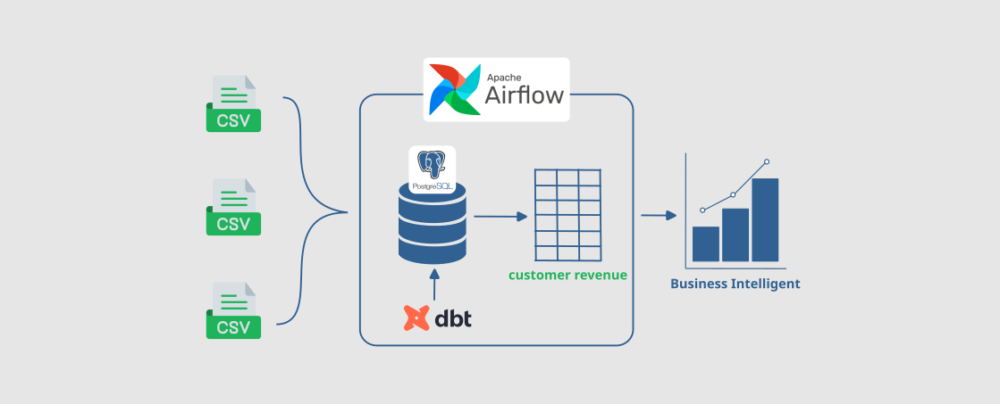
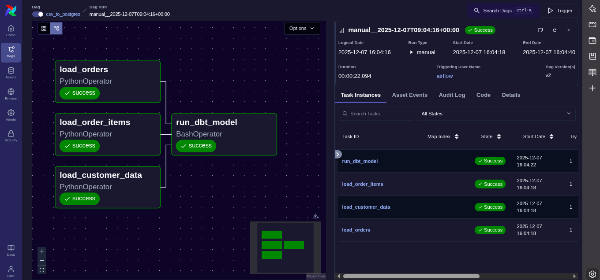

# airflow-dbt-postgres-data-pipeline
Using Airflow for data pipeline &amp; dbt for data transformation on postgresql

# *Project Overview*
Models a modern ETL (Extract, Transform, Load) data pipeline architecture, providing a clear blueprint for moving raw data from files into a production-ready data warehouse.

# *Problem To Be Solved*
The project solves the problem of unreliable, manually managed, and untransformed data ingestion. Without this pipeline, an organization faces the following common challenges:
1. Manual Data Movement: Relying on manual scripts or commands to load data, which is prone to human error and difficult to scale or schedule.
2. Lack of Transformation Logic: Raw source data (like individual customer, order, and order-item files) is not structured or aggregated into readily usable business entities, forcing analysts to manually clean and join data for every report.
3. Absence of Data Quality: Without a framework like dbt, there is no standardized way to version control, test, or document data transformations, leading to inconsistencies and distrust in the final reports.

# *Business Impact*
The direct impact of implementing this architecture is the creation of a single source of truth for core business metrics.
*  Trusted Data: The use of dbt for defining transformations and running data quality tests (as inferred by dbt_project.yml) ensures that all data models are reliable and accurate.
*  Faster Decision-Making: Analysts and business users can query highly structured and pre-calculated tables (e.g., a "fact_orders" or "dim_customer" table) instead of spending time on data preparation.
*  Reduced Operational Overhead: Automating the entire process with Airflow reduces the maintenance burden and frees up engineering time from manual data tasks.

# *Business Leverage*
The combination of these specific tools offers significant leverage by introducing software engineering best practices to data warehousing.
*  Modularity and Reusability (dbt): Transformations are written as modular SQL models, allowing new analysis to leverage existing base models, reducing redundant code and ensuring consistency across departments.
*  Scalability (Airflow): Airflow can effortlessly manage increasing data volumes and pipeline complexity by adding new DAGs (Directed Acyclic Graphs) and parallelizing tasks without redesigning the core infrastructure.
*  Documentation: dbt provides automatic documentation generation, ensuring that all metrics and transformations are clearly defined and understood by everyone in the organization.
# *Project Flow*
1. Create database on PostgreSQL using SQL
   ```sql
   CREATE DATABASE customers_db;
   ```
2. Create docker-compose.yml and mount local(existing) dbt project  
   ```lvim
   volumes:
     ...
     # Existing: Mount local dbt project (includes dbt_project.yml and profiles.yml)
      - /home/mulyo/dbt_snowflake/customers/:/usr/local/airflow/dbt_project:rw
     ...
   ```
3. Install into dedicated VENV path through Dockerfile
   ```bash
    # The dbt executable will now be at /opt/dbt_venv/bin/dbt
     RUN python -m venv /opt/dbt_venv && \
     /opt/dbt_venv/bin/pip install --no-cache-dir \
     dbt-postgres
   ```
4. Build Airflow
   ```bash
   docker-compose up airflow-init

   docker-compose up -d
   ```
5. Check Airflow & dbt readiness
   ```bash
   > docker ps
   CONTAINER ID   IMAGE                          COMMAND                  CREATED       STATUS                 PORTS    NAMES
   d5e5ebbbeb2c   airflow_docker_airflow-worker  "/usr/bin/dumb-init …"   4 hours ago   Up 4 hours (healthy)   8080/tcp airflow_docker_airflow-worker_1
   .....

   # checking airflow container
   > doccker exec -it airflow_docker_airflow-worker_1 bash
   ---airflow---
   default@91b5217b254c:/opt/airflow$ ls
   config  dags  logs  plugins
   default@91b5217b254c:/opt/airflow$ cd /opt/dbt_venv/
   default@91b5217b254c:/opt/dbt_venv$ source bin/activate
   (dbt_venv) default@91b5217b254c:/opt/dbt_venv$ dbt --version
   Core:
     - installed: 1.10.15
     - latest:    1.10.15 - Up to date!

   Plugins:
     - postgres: 1.9.1 - Up to date!

   ---dbt---
   (dbt_venv) default@91b5217b254c:/opt/dbt_venv$ cd /usr/local/airflow/dbt_project/
   
   (dbt_venv) default@91b5217b254c:/usr/local/airflow/dbt_project$ ls   
   README.md  analyses  dbt_project.yml  example  logs  macros  models  profiles.yml  seeds  snapshots  target  tests
   (dbt_venv) default@91b5217b254c:/usr/local/airflow/dbt_project$ dbt debug
   22:34:48  Running with dbt=1.10.15
   22:34:48  dbt version: 1.10.15
   22:34:48  python version: 3.11.14
   22:34:48  python path: /opt/dbt_venv/bin/python3.11
   22:34:48  os info: Linux-6.8.0-88-generic-x86_64-with-glibc2.36
   22:34:48  Using profiles dir at /usr/local/airflow/dbt_project
   22:34:48  Using profiles.yml file at /usr/local/airflow/dbt_project/profiles.yml
   22:34:48  Using dbt_project.yml file at /usr/local/airflow/dbt_project/dbt_project.yml
   22:34:48  adapter type: postgres
   22:34:48  adapter version: 1.9.1
   22:34:48  Configuration:
   22:34:48    profiles.yml file [OK found and valid]
   22:34:48    dbt_project.yml file [OK found and valid]
   22:34:48  Required dependencies:
   22:34:48   - git [OK found]

   22:34:48  Connection:
   22:34:48    host: 192.168.49.1
   22:34:48    port: 5432
   22:34:48    user: postgres
   22:34:48    database: customers_db
   22:34:48    schema: transaction
   22:34:48    connect_timeout: 10
   22:34:48    role: None
   22:34:48    search_path: None
   22:34:48    keepalives_idle: 0
   22:34:48    sslmode: None
   22:34:48    sslcert: None
   22:34:48    sslkey: None
   22:34:48    sslrootcert: None
   22:34:48    application_name: dbt
   22:34:48    retries: 1
   22:34:48  Registered adapter: postgres=1.9.1
   22:34:48    Connection test: [OK connection ok]

   22:34:48  All checks passed!
   ```
6. Run airflow dag from webpage
   Access from: http://0.0.0.0:8080/
   <br>Dags > Choose dag (csv_to_postgres) > manual trigger
   
8. Check result on PostgreSQL
   ```bash
   ❯ psql -U postgres -h 127.0.0.1 -p 5432
   Password for user postgres:******
   ```
   ```sql
   customers_db=# \d
           List of relations
    Schema |    Name    | Type  |  Owner
   --------+------------+-------+----------
    public | customers  | table | postgres
    public | orderitems | table | postgres
    public | orders     | table | postgres
   (3 rows)

   customers_db=# \d transaction.customerrevenue
                  Table "transaction.customerrevenue"
       Column    |          Type          | Collation | Nullable | Default
   --------------+------------------------+-----------+----------+---------
    customer_id  | integer                |           |          |
    customername | character varying(255) |           |          |
    ordercount   | bigint                 |           |          |
    revenue      | numeric                |           |          |

   customers_db=# select * from transaction.customerrevenue limit 5;
    customer_id |   customername   | ordercount | revenue
   -------------+------------------+------------+---------
       11031 | Alexander Palmer |          3 |  583.19
       11011 | Chelsey Lopez    |          3 |  528.65
       11091 | Denise Ryan      |          4 |  835.24
       11041 | Kenneth Palmer   |          4 |  718.45
       11083 | Gabriel Lee      |          4 |  689.97
   (5 rows)
   ``

# *Assumption*
1. PostgreSQL database (exp: customers_db) for database/data warehouse, I use postgreSQL under docker container.
2. Airflow running using docker container, build & run using docker-compose.yml
3. DBT (Data Build Tool) on docker, build with Dockerfile with setup to communicate from Airflow
